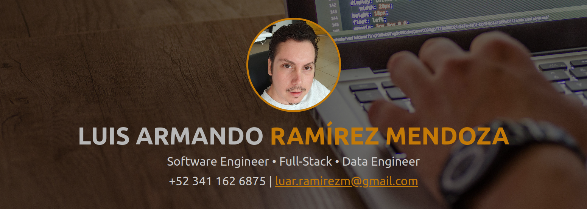

# Hi, I am Armando.

     

## About me.
I am a full-stack software developer with a main focus on back-end development, experienced in data engineering and web app development with Django and Vue.js, and occasionally using Angular or React.

## Skills and tools.

     
     
     
     
     
     
     
     
     
     
     
     
     
    

## Contact.

